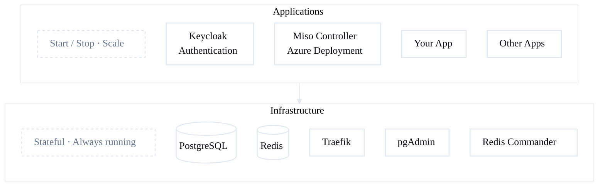

# Infrastructure Guide

← [Documentation index](README.md)

We recommend running the AI Fabrix platform in **Microsoft Azure**. The aifabrix CLI works the same locally and in Azure—no manual config difference for the user.

## What is Infrastructure?

When you run `aifabrix up-infra`, you get **shared baseline services** that all your applications use:

### PostgreSQL (port 5432)
- Database server for your applications
- Includes pgvector extension for AI/ML workloads
- **Access:** localhost:5432
- **Username:** pgadmin
- **Password:** admin123

### Redis (port 6379)
- In-memory data store for caching
- Session storage
- Message queue for background jobs
- **Access:** localhost:6379

### pgAdmin (port 5050) - Optional
- Web UI for database management
- Create/edit databases, run SQL queries
- **Access:** <http://localhost:5050>
- **Login:** <admin@aifabrix.dev> / admin123

### Redis Commander (port 8081) - Optional
- Web UI for Redis management  
- View keys, monitor performance
- **Access:** <http://localhost:8081>
- **Login:** admin / admin123

### Traefik (ports 80/443) - Optional
- Reverse proxy for local routing (matches Front Door routing config)

```mermaid
%%{init: {
  "theme": "base",
  "themeVariables": {
    "fontFamily": "Poppins, Arial Rounded MT Bold, Arial, sans-serif",
    "fontSize": "16px",
    "background": "#FFFFFF",
    "primaryColor": "#F8FAFC",
    "primaryTextColor": "#0B0E15",
    "primaryBorderColor": "#E2E8F0",
    "lineColor": "#E2E8F0",
    "textColor": "#0B0E15",
    "subGraphTitleColor": "#64748B",
    "subGraphTitleFontWeight": "500",
    "borderRadius": 16
  },
  "flowchart": {
    "curve": "linear",
    "nodeSpacing": 34,
    "rankSpacing": 34,
    "padding": 10
  }
}}%%

flowchart TB

%% =======================
%% Styles
%% =======================
classDef base fill:#FFFFFF,color:#0B0E15,stroke:#E2E8F0,stroke-width:1.5px;
classDef note fill:#FFFFFF,color:#64748B,stroke:#E2E8F0,stroke-width:1.5px,stroke-dasharray:4 4;

%% =======================
%% Infrastructure
%% =======================
subgraph Infrastructure["Infrastructure"]
    direction TB
    InfraNote["Stateful · Always running"]:::note
    Postgres[(PostgreSQL)]:::base
    Redis[(Redis)]:::base
    Traefik[Traefik]:::base
end

%% =======================
%% Operations Tools
%% =======================
subgraph OpsTools["Operations Tools"]
    direction TB
    OpsNote["On-demand / Admin only"]:::note
    pgAdmin[pgAdmin]:::base
    RedisCommander[Redis Commander]:::base
end

%% =======================
%% Applications
%% =======================
subgraph Applications["Applications"]
    direction TB
    AppNote["Start / Stop · Scale"]:::note
    Keycloak[Keycloak<br/>Identity & Access]:::base
    MisoController[Miso Controller<br/>Deployment & Governance]:::base
    YourApp[Customer Application]:::base
    OtherApps[Other Applications]:::base
end

%% =======================
%% Flow
%% =======================
Applications --> Infrastructure
OpsTools --> Infrastructure
```

- **Access:** <http://localhost:80>, <https://localhost:443>



---

## Commands

### Start Infrastructure
```bash
aifabrix up-infra
```

Start with Traefik:
```bash
aifabrix up-infra --traefik
```

**First time?** Docker downloads images (2-3 minutes).

**What you'll see:**
- Containers starting
- Health checks passing
- Service URLs

### Stop Infrastructure
```bash
aifabrix down-infra
```

Stops all containers. **Your data is preserved** in Docker volumes.

### Check Status
```bash
aifabrix doctor
```

Shows what's running, what's not, and how to fix issues.

### Reset Everything (Delete All Data)
```bash
aifabrix down-infra --volumes
```

⚠️ **Warning:** This deletes all databases, Redis data, everything. Use for fresh start.

---

<a id="traefik"></a>
## Traefik configuration and validation

Traefik is an optional reverse proxy for local routing (matches Front Door routing config in production). The builder can start Traefik as part of infrastructure and generates Traefik labels when `frontDoorRouting.enabled` is true in your app's `variables.yaml`.

**Enable Traefik:**
```bash
aifabrix up-infra --traefik
```
This starts Traefik (ports 80/443) and saves `traefik: true` to `~/.aifabrix/config.yaml`. Use `aifabrix up-infra --no-traefik` to disable and persist.

**Basic config:** Traefik listens on HTTP (80) and HTTPS (443). For TLS, set environment variables before running `aifabrix up-infra --traefik`:
- `TRAEFIK_CERT_STORE` – Certificate store name (e.g. `wildcard`)
- `TRAEFIK_CERT_FILE` – Absolute path to certificate file
- `TRAEFIK_KEY_FILE` – Absolute path to private key file

**How the builder uses Traefik:** When an app has `frontDoorRouting.enabled: true` in `variables.yaml`, the builder generates Traefik labels for the app's docker-compose service (router rule from host + path, TLS, optional cert store). The builder does not configure Traefik itself beyond starting it; labels are applied when you run the app with Traefik on the same Docker network.

**Requirements:** DNS or `/etc/hosts` entry for `${DEV_USERNAME}.aifabrix.dev` → localhost if using host-based routing. See [variables.yaml frontDoorRouting](configuration/variables-yaml.md) for pattern and host configuration.

---

## Quick install: up-miso

Install Keycloak and Miso Controller **from images** (no build). Use when you have pre-built images and want a fast platform setup for testing.

**Prerequisites:** Infrastructure must be up (`aifabrix up-infra`).

```bash
aifabrix up-miso
```

**What happens:**
- Ensures `builder/keycloak` and `builder/miso-controller` exist (from templates if missing)
- Sets URL secrets for Keycloak and Miso Controller (ports from developer ID)
- Resolves env with auto-generated secrets (force) so no manual secret setup is needed for testing
- Runs Keycloak, then Miso Controller (no build step)

**Options:**
- `-r, --registry <url>` - Override registry for both apps (e.g. `myacr.azurecr.io`)
- `--registry-mode <mode>` - Override registry mode (`acr` or `external`)
- `-i, --image <key>=<value>` - Override image (e.g. `keycloak=myreg/keycloak:v1`, `miso-controller=myreg/miso:v1`); can be repeated

**After up-miso:** Run onboarding and register Keycloak from the miso-controller repo if needed.

→ [Infrastructure Commands](commands/infrastructure.md#aifabrix-up-miso) for full reference.

---

## Up Dataplane (dev)

Register (or rotate if already registered), deploy to the controller, then run the **dataplane** app locally in the **dev** environment. Always local deployment: use when developing against the dataplane or testing pipeline in dev.

**Prerequisites:** Logged in (`aifabrix login`), environment set to `dev` (`aifabrix auth config --set-environment dev`).

```bash
aifabrix login --environment dev
aifabrix up-dataplane
```

**What happens:**
- Ensures `builder/dataplane` exists (from template if missing)
- If dataplane is already registered in the environment → rotates secret; otherwise → registers the app
- Deploys dataplane via Miso Controller (sends manifest)
- Runs dataplane locally (`aifabrix run dataplane`)

**Options:**
- `-r, --registry <url>` - Override registry for dataplane image
- `--registry-mode <mode>` - Override registry mode (`acr` or `external`)
- `-i, --image <ref>` - Override dataplane image reference (e.g. `myreg/dataplane:latest`)

→ [Infrastructure Commands](commands/infrastructure.md#aifabrix-up-dataplane) for full reference.

---

## Optional Platform Applications

**Keycloak and Miso-Controller are NOT infrastructure** - they are regular applications you install and run like your own apps.

### Why Separate?

**Infrastructure** = Always running, shared by all apps (Postgres, Redis)

**Applications** = Start/stop as needed, specific purpose (Keycloak, Miso-Controller, your apps)

You might not need Keycloak or Miso-Controller for basic development. Install them when you need them.



---

## Install Keycloak (Authentication)

Keycloak provides authentication and user management for your applications.

### 1. Create
```bash
aifabrix create keycloak --port 8082 --database --template keycloak
```

### 2. Build
```bash
aifabrix build keycloak
```

### 3. Run
```bash
aifabrix run keycloak
```

### 4. Access
**URL:** <http://localhost:8082>

**Admin login:** admin / admin123

### What You Get
- User authentication
- Single Sign-On (SSO)
- Role-based access control
- Social login providers

---

## Install Miso-Controller (Azure Deployment)

- **Docker (local):** The steps below are for **Docker/local** install (create, build, run). Use this for local development.
- **Azure:** For production or cloud, install the platform via **Azure Marketplace** first; then use the controller URL from that deployment. See Azure documentation or marketplace listing for Azure-specific setup.

Miso Controller deploys your applications to Azure or runs them locally in Docker.

### 1. Create (Docker / local)
```bash
aifabrix create miso-controller --port 3000 --database --redis --template miso-controller
```

### 2. Build
```bash
aifabrix build miso-controller
```

### 3. Run
```bash
aifabrix run miso-controller
```

### 4. Access
**URL:** <http://localhost:3000>

**What You Get**
- Deploy to Azure Container Apps
- Manage deployments via API
- Monitor application status
- Handle secrets and configuration

---

## Common Questions

### Do I need to run infrastructure all the time?
Only when developing. Start with `aifabrix up-infra` when you begin work, stop with `aifabrix down-infra` when done.

### What happens to my data when I stop?
It's preserved in Docker volumes. Your databases and Redis data persist between restarts.

### How do I connect to Postgres from my app?
**From Docker container:** `postgres:5432`  
**From your local machine:** `localhost:5432`

The SDK handles this automatically in generated config files.

### Can I use my own Postgres/Redis?
Yes! Configure connection strings in your app's `env.template`. The SDK doesn't force you to use infrastructure services.

### How much disk space does this use?

Figures below are approximate; run `docker system df` and `docker stats` for your setup.

- **Initial download (base infra):** Approximately 0.5–1.5 GB for Postgres and Redis images (varies by image version and platform).
- **Full platform (Keycloak, Miso Controller, Dataplane, etc.):** Roughly 10–15 GB for all platform images; exact size depends on images used. Check with `docker images` or your registry to confirm.
- **Running (base infra):** Approximately 256 MB–1 GB RAM (Postgres and Redis; add more if using Traefik, pgAdmin, or Redis Commander). CPU usage is low when idle.
- **Data volumes:** Depends on your usage (databases, Redis persistence). Monitor with `docker system df`.

---

## Troubleshooting

**Port 5432 already in use**  
→ You have another Postgres running. Stop it or change the port.

**Port 6379 already in use**  
→ You have another Redis running. Stop it first.

**Docker not running**  
→ Start Docker Desktop, then run `aifabrix up-infra` again.

**"Cannot connect to Docker daemon"**  
→ Make sure Docker Desktop is running and you're logged in.

**Containers start but apps can't connect**  
→ Run `aifabrix doctor` to check connectivity.

