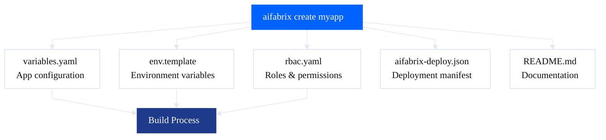

# Quick Start Guide

Get your AI Fabrix application running in 5 minutes.

← [Back to README](../README.md)

## Step 1: Install

```bash
npm install -g @aifabrix/builder
```

**Alias:** `aifx` is available as a shortcut—use `aifx` instead of `aifabrix` in any command.

```mermaid
%%{init: {
  "theme": "base",
  "themeVariables": {
    "fontFamily": "Poppins, Arial Rounded MT Bold, Arial, sans-serif",
    "fontSize": "16px",
    "background": "#FFFFFF",
    "primaryColor": "#F8FAFC",
    "primaryTextColor": "#0B0E15",
    "primaryBorderColor": "#E2E8F0",
    "lineColor": "#E2E8F0",
    "textColor": "#0B0E15",
    "borderRadius": 16
  },
  "flowchart": {
    "curve": "linear",
    "nodeSpacing": 34,
    "rankSpacing": 34,
    "padding": 10
  }
}}%%

flowchart LR

%% =======================
%% Styles
%% =======================
classDef base fill:#FFFFFF,color:#0B0E15,stroke:#E2E8F0,stroke-width:1.5px;
classDef primary fill:#0062FF,color:#ffffff,stroke-width:0px;

%% =======================
%% Flow
%% =======================
Install[Install CLI]:::primary --> Up[Start Infrastructure]:::base
Up --> Create[Create App]:::base
Create --> Config[Review Configuration]:::base
Config --> Build[Build Image]:::base
Build --> Run[Run Locally]:::base
Run --> Register[Register Application]:::base
Register --> Deploy[Deploy to Azure]:::primary
```



## Step 2: Start Infrastructure

```bash
aifabrix up
```

**What starts:**
- PostgreSQL at localhost:5432
- Redis at localhost:6379

**Optional (Traefik):**
```bash
aifabrix up --traefik
```

**First time?** Docker downloads images (takes 2-3 minutes).

→ [What is Infrastructure?](infrastructure.md)

## Step 3: Create Your App

```bash
aifabrix create myapp
```

**You'll be asked:**
- Port? *(default: 3000)*
- Language? *TypeScript/Node.js or Python* (list selector)
- Need database? *y/n*
- Need Redis? *y/n*
- Need storage? *y/n*
- Need authentication? *y/n*
- Need GitHub Actions workflows? *y/n*
- Need Controller deployment workflow? *y/n* (if GitHub=yes)
- Controller URL? *(if Controller=yes)*

**What gets created:**
- `builder/<app>/variables.yaml` - App configuration
- `builder/<app>/env.template` - Environment variables  
- `builder/<app>/rbac.yaml` - Roles & permissions (if authentication=yes)
- `builder/<app>/aifabrix-deploy.json` - Deployment manifest
- `builder/<app>/README.md` - Application documentation



**Pro tip:** Use flags to skip prompts:
```bash
aifabrix create myapp --port 3000 --database --language typescript
```

**Want GitHub Actions workflows?** Add `--github`:
```bash
aifabrix create myapp --github --main-branch main
```

**Want to use a template?** Add `--template`:
```bash
aifabrix create myapp --template miso-controller --port 3000
```

**Want extra GitHub workflow steps?** Add `--github-steps`:
```bash
aifabrix create myapp --github --github-steps npm
```
**Note:** Step templates must exist in `templates/github/steps/{step}.hbs`. The `npm` step adds NPM publishing to the release workflow.

**Creating an External System Integration?** Use `--type external`:
```bash
aifabrix create hubspot-test --type external
```
Prompts for: system key, display name, description, system type (openapi/mcp/custom), authentication type (oauth2/apikey/basic), number of datasources.

**What gets created for external systems:**
- `integration/<app>/variables.yaml` - App configuration with `app.type: "external"` and `externalIntegration` block
- `integration/<app>/<systemKey>-system.json` - External system configuration
- `integration/<app>/<systemKey>-datasource-<datasource-key>.json` - Datasource JSON files (all in same folder)
- `integration/<app>/<systemKey>-deploy.json` - Deployment manifest (generated)
- `integration/<app>/env.template` - Environment variables template
- `integration/<app>/README.md` - Application documentation

**Note:** External systems don't require Docker images, ports, or build configuration. They use the pipeline API for deployment via Miso Controller.

→ [External Systems Guide](external-systems.md) - Complete guide with HubSpot example

## Step 4: Review Configuration Your App

### builder/myapp/variables.yaml
```yaml
app:
  key: myapp
  displayName: "My App"
  port: 3000

requires:
  database: true
  databases:
    - name: myapp

build:
  language: typescript
```

**What to check:**
- Display name looks good?
- Need more databases? Add them to the list
- Want different local port? Set `build.localPort`

### Optional: Traefik Routing

If you want to test routing configuration locally (same as Azure Front Door), add:

```yaml
frontDoorRouting:
  enabled: true
  host: ${DEV_USERNAME}.aifabrix.dev
  pattern: /api/*
  tls: true
  certStore: wildcard  # Optional: specify certificate store for wildcard certificates
```

This generates Traefik labels for local development. See [Configuration Reference](configuration.md#frontdoorrouting) for details.

**Note:** If you're using a wildcard certificate, add `certStore` with the name of your Traefik certificate store. See [Traefik Routing](running.md#traefik-routing-optional) for certificate store setup instructions.

### builder/myapp/env.template
```bash
# Language-specific variables (auto-added based on build.language)
NODE_ENV=${NODE_ENV}  # Resolves to 'production' (docker) or 'development' (local)

# Application environment (auto-added)
PORT=3000
ALLOWED_ORIGINS=http://localhost:*,
WEB_SERVER_URL=http://localhost:${PORT},

# Database configuration (if requires.database: true)
DATABASE_URL=kv://databases-0-urlKeyVault
DATABASE_HOST=localhost
DATABASE_PORT=5432
```

**Note:** For Python apps, `PYTHONUNBUFFERED`, `PYTHONDONTWRITEBYTECODE`, and `PYTHONIOENCODING` are automatically added instead of `NODE_ENV`.

**What to add:**
- Your app's environment variables
- API keys (use `kv://key-name` for secrets)
- Feature flags

**Have existing .env?** Copy variables here. The SDK converts them to templates.

→ [Configuration Reference](configuration.md)

### GitHub Actions Workflows (Optional)

If you used `--github`, you'll also have:
- `.github/workflows/ci.yaml` - CI/CD pipeline
- `.github/workflows/release.yaml` - Release automation  
- `.github/workflows/pr-checks.yaml` - Pull request validation

**What they do:**
- **CI Pipeline** - Runs tests, linting, and security checks on every push/PR
- **Release Pipeline** - Publishes to NPM and creates GitHub releases on version tags
- **PR Checks** - Validates code quality and commit conventions

**Required secrets** (add in GitHub repository settings):

**For deployment (repository level):**
- `MISO_CONTROLLER_URL` - Controller URL (e.g., `https://controller.aifabrix.dev`)

**For deployment (environment level, e.g., dev):**
- `DEV_MISO_CLIENTID` - Pipeline ClientId from registration
- `DEV_MISO_CLIENTSECRET` - Pipeline ClientSecret from registration

**Optional:**
- `NPM_TOKEN` - For publishing packages
- `CODECOV_TOKEN` - For coverage reporting

→ [GitHub Workflows Guide](github-workflows.md)

## Step 5: Build

```bash
aifabrix build myapp
```

**What happens:**
1. Looks for `Dockerfile` in your app root
2. If not found, generates from template (Node 20 Alpine or Python 3.11 Alpine)
3. Builds Docker image: `myapp:latest`
4. Creates `.env` file from `env.template`

**Want to use your own Dockerfile?**  
Place it in your app root - the SDK will use it.

**Need to regenerate template?**  
```bash
aifabrix build myapp --force-template
```

→ [Building Details](building.md)

## Step 6: Run

```bash
aifabrix run myapp
```

**What happens:**
- Creates database and user automatically (if app requires database)
- Starts container as `aifabrix-myapp`
- Connects to Postgres and Redis
- Maps port for localhost access

**Access your app:**  
<http://localhost:3000> (or your port)

**View logs:**
```bash
docker logs aifabrix-myapp -f
```

**Stop app:**
```bash
docker stop aifabrix-myapp
```

→ [Running Details](running.md)

## Step 7: Register Application

Before deploying, register your application to get pipeline credentials:

```bash
# Login (saves controller and environment to config.yaml)
aifabrix login --controller https://controller.aifabrix.dev --environment dev

# Register application (uses controller and environment from config)
aifabrix app register myapp

# Credentials are automatically saved locally
```

To switch controller or environment later: `aifabrix auth config --set-controller <url>` or `aifabrix auth config --set-environment <env>`.

## Step 8: Deploy to Azure

### Manual Deployment

```bash
# Push to Azure Container Registry
aifabrix push myapp --registry myacr.azurecr.io --tag v1.0.0

# Deploy via Miso Controller (uses controller and environment from config)
aifabrix deploy myapp
```

### Automated CI/CD Deployment

1. **Add secrets in GitHub repository settings:**
   - `MISO_CLIENTID` - From registration
   - `MISO_CLIENTSECRET` - From registration
   - `MISO_CONTROLLER_URL` - Controller URL

2. **Set up GitHub Actions workflow** (see [GitHub Workflows Guide](github-workflows.md))

→ [Deployment Guide](deploying.md)

---

## External System Workflow

External systems integrate with third-party APIs (like HubSpot, Salesforce, etc.) and don't require Docker containers or traditional application deployment.

### Quick Example: HubSpot Integration

```bash
# Login first (saves controller and environment to config)
aifabrix login --controller https://controller.aifabrix.dev --environment dev

# Create HubSpot external system
aifabrix create hubspot-test --type external

# Configure authentication and datasources in integration/hubspot/
# See integration/hubspot/ for complete example

# Validate configuration
aifabrix validate hubspot

# Deploy to controller (uses config)
aifabrix deploy hubspot
```

**What gets created:**
```yaml
integration/
  hubspot/
    variables.yaml                    # App configuration
    hubspot-system.json              # External system definition
    hubspot-datasource-company.json  # Companies datasource
    hubspot-datasource-contact.json  # Contacts datasource
    hubspot-datasource-deal.json     # Deals datasource
    hubspot-deploy.json              # Deployment manifest (generated)
    env.template                     # Environment variables
```

All files are in the same folder for easy viewing and management.

→ [Complete External Systems Guide](external-systems.md) - Step-by-step guide with HubSpot example, field mappings, authentication setup, and troubleshooting

---

## Next Steps

### Learn More
- [All CLI Commands](commands/README.md) - Complete command reference
- [Configuration](configuration.md) - Detailed config file docs
- [Building](building.md) - Custom Dockerfiles and templates
- [Running](running.md) - Local development workflow
- [GitHub Workflows](github-workflows.md) - CI/CD automation setup
- [Developer Isolation](developer-isolation.md) - Run multiple developers on the same machine

### Install Platform Apps
- [Keycloak](infrastructure.md#install-keycloak) - Authentication and user management
- [Miso Controller](infrastructure.md#install-miso-controller) - Azure deployment

### Common Tasks

**Add another database:**
```yaml
# builder/myapp/variables.yaml
requires:
  databases:
    - name: myapp
    - name: myapp-analytics  # Add this
```

**Add environment variable:**
```bash
# builder/myapp/env.template
MY_API_KEY=kv://my-api-keyKeyVault
```

**Rebuild after code changes:**
```bash
aifabrix build myapp
aifabrix run myapp
```

**Check if everything is working:**
```bash
aifabrix doctor
```

**Set up GitHub Actions (if you used --github):**
1. Register application: `aifabrix app register myapp`
2. Add secrets in repository settings:
   - Repository level: `MISO_CONTROLLER_URL` - Your controller URL
   - Environment level (dev): `DEV_MISO_CLIENTID` and `DEV_MISO_CLIENTSECRET` - From registration output
3. Push your code to GitHub
4. Watch automatic deployment!

---

## Troubleshooting

**"Docker is not running"**  
→ Start Docker Desktop

**"Port 5432 already in use"**  
→ Stop other Postgres: `docker stop <container>`  
→ Or use [Developer Isolation](developer-isolation.md) to avoid port conflicts

**"Infrastructure not running"**  
→ `aifabrix up`

**"Build failed"**  
→ Check Dockerfile syntax  
→ Run `aifabrix doctor` to check Docker

**"Can't connect to database"**  
→ Check `DATABASE_URL` in `.env`  
→ Verify database exists: `docker exec aifabrix-postgres psql -U pgadmin -l`

**"GitHub Actions failing"**  
→ Check repository secrets are configured  
→ Verify NPM token has publish permissions  
→ Review workflow logs in GitHub Actions tab

→ [More Help](commands/README.md)
